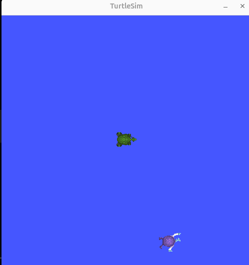
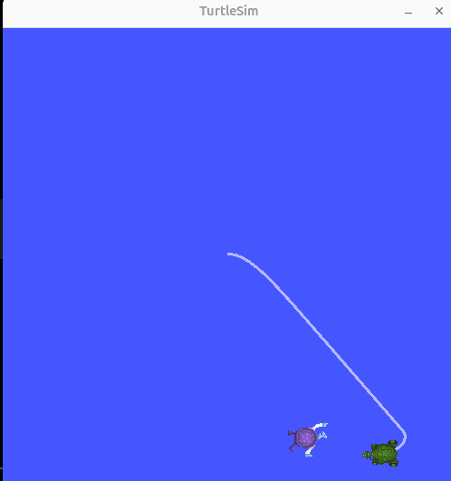
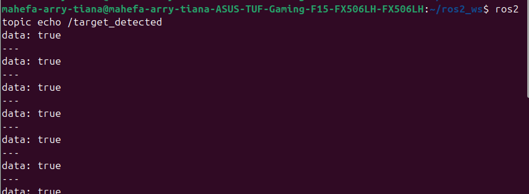

# turtle_scanner_mahefa

TP2 ROBO L2 - Turtle Scanner

Projet ROS 2 de balayage en serpentin et de detection d'une tortue cible dans TurtleSim. Le projet comprend le spawn aleatoire d'une cible, l'exploration methodique de l'espace, la detection de la cible, un service de reinitialisation de mission et un client automatique.

---

## Architecture des noeuds

```text
turtlesim_node
    │
    ├── /turtle1/pose --------------------------┐
    ├── /spawn <----- spawn_target.py          │
    └── /turtle1/cmd_vel <--- turtle_scanner_node.py
                                               │
/turtle_target/pose ---------------------------┘

turtle_scanner_node.py
    ├── Sub : /turtle1/pose
    ├── Sub : /turtle_target/pose
    ├── Pub : /turtle1/cmd_vel
    ├── Pub : /target_detected
    └── Srv : /reset_mission

mission_client.py
    ├── Sub : /target_detected
    └── Client : /reset_mission
```

---

## Packages

### `turtle_scanner`
Package Python principal. Il contient :
- `spawn_target.py` : spawn d'une tortue cible a une position aleatoire
- `turtle_scanner_node.py` : balayage en serpentin, regulation, detection et service de reset
- `mission_client.py` : automatisation de 3 cycles de mission

### `turtle_interfaces`
Package d'interfaces personnalisees. Il contient :
- `srv/ResetMission.srv`

---

## Topics et services

| Nom | Type | Role |
|-----|------|------|
| `/turtle1/pose` | `turtlesim/msg/Pose` | Pose de la tortue scanner |
| `/turtle_target/pose` | `turtlesim/msg/Pose` | Pose de la tortue cible |
| `/turtle1/cmd_vel` | `geometry_msgs/msg/Twist` | Commande de deplacement |
| `/target_detected` | `std_msgs/msg/Bool` | Etat de detection de la cible |
| `/spawn` | `turtlesim/srv/Spawn` | Creation d'une tortue cible |
| `/kill` | `turtlesim/srv/Kill` | Suppression de l'ancienne cible |
| `/reset_mission` | `turtle_interfaces/srv/ResetMission` | Relance d'une mission |

---

## Fichier de service

```srv
float64 target_x
float64 target_y
bool random_target
---
bool success
string message
```

---

## Prerequis

- ROS 2 Jazzy
- `turtlesim` installe

## Installation

```bash
cd ~/ros2_ws/src
git clone https://github.com/Mahefa99/turtle_scanner_mahefa.git

cd ~/ros2_ws
colcon build --packages-select turtle_interfaces turtle_scanner
source install/setup.bash
```

---

## Lancement

### 1. Lancer TurtleSim

```bash
source ~/ros2_ws/install/setup.bash
ros2 run turtlesim turtlesim_node
```

### 2. Spawner la cible

```bash
source ~/ros2_ws/install/setup.bash
ros2 run turtle_scanner spawn_target
```

### 3. Lancer le scanner

```bash
source ~/ros2_ws/install/setup.bash
ros2 run turtle_scanner turtle_scanner_node
```

### 4. Observer la detection

```bash
source ~/ros2_ws/install/setup.bash
ros2 topic echo /target_detected
```

### 5. Lancer le client automatique

```bash
source ~/ros2_ws/install/setup.bash
ros2 run turtle_scanner mission_client
```

### 6. Relancer une mission manuellement

```bash
source ~/ros2_ws/install/setup.bash
ros2 service call /reset_mission turtle_interfaces/srv/ResetMission "{random_target: true}"
```

---

## Parametres de regulation

| Parametre | Valeur actuelle | Effet observe |
|-----------|-----------------|---------------|
| `Kp_ang` | `4.0` | Valeur initiale a ajuster apres tests |
| `Kp_lin` | `1.5` | Valeur initiale a ajuster apres tests |

Si `Kp_ang` est trop fort, la tortue peut osciller. S'il est trop faible, elle tourne trop lentement.
Si `Kp_lin` est trop fort, la tortue peut arriver trop vite et depasser la cible. S'il est trop faible, le balayage devient lent.

---

## Screenshots

Ajoutez vos captures d'ecran dans le dossier `image/` du depot.

### Spawn de la cible



### Balayage en serpentin



### Detection de la cible

Une capture TurtleSim pourra etre ajoutee ici si besoin.

### Preuve terminal de detection


